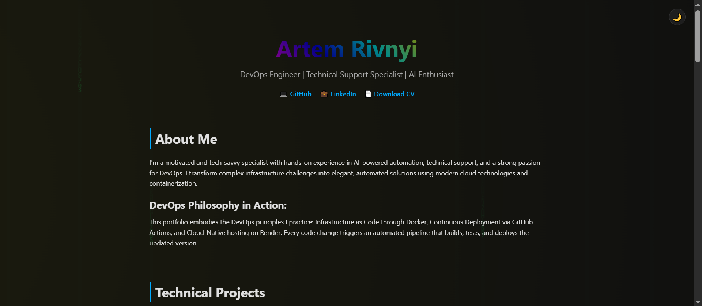
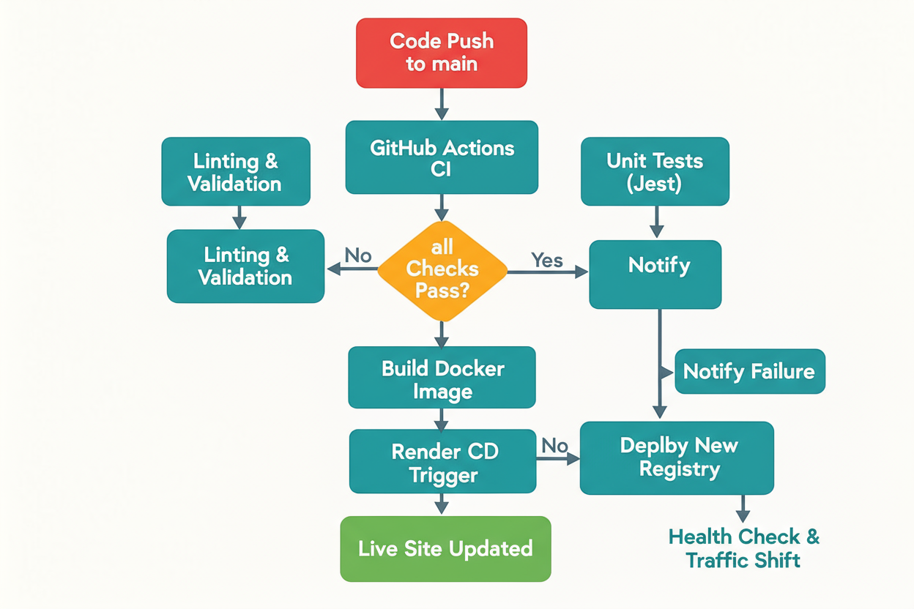

# Personal Portfolio with Automated CI/CD Pipeline


[](LICENSE)
[](https://github.com/ArtemRivnyi/personal-page-devops/actions/workflows/cicd.yml)
[](https://personal-page-devops.onrender.com/)
[](https://github.com/ArtemRivnyi/personal-page-devops)
[](https://github.com/ArtemRivnyi/personal-page-devops/commits/main )
[](https://github.com/ArtemRivnyi/personal-page-devops/stargazers )

A modern, responsive **portfolio website** showcasing technical projects and skills, featuring a robust and fully automated **Continuous Integration/Continuous Deployment (CI/CD) pipeline**. This project serves as a practical demonstration of DevOps expertise, ensuring a consistent environment through Docker and seamless, zero-downtime deployment via Render.

## 📝 Table of Contents

*   [🌐 Live Demo and Screenshot](#-live-demo-and-screenshot)
*   [🎯 Project Goals](#-project-goals)
*   [🛠️ Tech Stack](#-tech-stack)
*   [✨ Key Features](#-key-features)
*   [🔄 CI/CD Pipeline Workflow](#-ci/cd-pipeline-workflow)
*   [📊 Performance Metrics](#-performance-metrics)
*   [🚀 Local Development](#-local-development)
*   [🧪 Automated Testing and Validation](#-automated-testing-and-validation)
*   [📁 Project Structure](#-project-structure)
*   [🤝 Contributing](#-contributing)
*   [📄 License](#-license)
*   [🧰 Maintainer](#-maintainer)

## 🌐 Live Demo and Screenshot

The live version of the portfolio is available here: [https://personal-page-devops.onrender.com/](https://personal-page-devops.onrender.com/)

This is a snapshot of the main page, demonstrating the clean, responsive design and dark mode functionality.



## 🎯 Project Goals

The primary objectives of this project are:

| Goal | Description | Value Proposition |
| :-- | :-- | :-- |
| **Showcase Technical Skills** | Provide a professional, interactive platform to present projects and expertise. | Establishes credibility and serves as a dynamic resume. |
| **Demonstrate DevOps Mastery** | Implement a robust, automated CI/CD workflow from commit to production. | Proves hands-on experience with modern DevOps practices. |
| **Ensure Environment Consistency** | Utilize Docker to containerize the application. | Guarantees that the application runs reliably across all environments (Dev, CI, Prod). |
| **Zero-Downtime Deployment** | Leverage modern cloud services (Render) for seamless updates. | Ensures high availability and a professional user experience. |

## 🛠️ Tech Stack

This project is built and maintained using the following core technologies:

| Category | Technologies | Description |
| :-- | :-- | :-- |
| **Frontend** | HTML5, CSS3, JavaScript (ES6+) | Standard web technologies for structure, styling, and interactivity. |
| **Containerization** | Docker, `Dockerfile` | Ensures a consistent, isolated environment for the application. |
| **CI/CD** | GitHub Actions | Automates the build, test, and deployment process upon code changes. |
| **Deployment** | Render | Cloud platform used for continuous, zero-downtime hosting. |
| **Testing** | Jest, ESLint, Stylelint, HTML-Validate | Tools for unit testing, code quality, and style conformity. |
| **Version Control** | Git, GitHub | Standard workflow for collaborative development and source control. |

## ✨ Key Features

The portfolio is designed not just as a website, but as a **showcase of engineering best practices**.

*   **Automated Deployment:** A full CI/CD pipeline triggers on every push to the `main` branch, ensuring rapid iteration and reliability.
*   **Containerization:** The application is packaged in a Docker container, guaranteeing environment parity between local development, CI, and production.
*   **Responsive Design:** Optimized for optimal viewing and interaction across desktop, tablet, and mobile devices.
*   **Code Quality Gates:** Automated linting (ESLint, Stylelint) and validation (HTML-Validate) enforce high code standards before deployment.
*   **Unit Testing:** JavaScript functionality is covered by Jest unit tests, ensuring core logic is robust.
*   **Zero-Downtime Updates:** Seamless deployment experience on Render via automated webhook integration, ensuring high availability.

## 🔄 CI/CD Pipeline Workflow

The entire deployment process is fully automated using **GitHub Actions** for Continuous Integration and **Render** for Continuous Deployment. This workflow ensures that only tested and validated code reaches the production environment.

### Pipeline Diagram

The following diagram illustrates the flow from code commit to live deployment:



### Workflow Steps

1.  **Code Push**: A developer pushes changes to the `main` branch on GitHub.
2.  **GitHub Actions (CI)**: The `cicd.yml` workflow is triggered.
    *   **Validation**: Runs `npm run ci` which executes linting, style checks, and HTML validation.
    *   **Testing**: Executes Jest unit tests to verify JavaScript functionality.
3.  **Decision Gate**: If all tests and validation checks pass, the pipeline proceeds. If any check fails, the pipeline stops, and a failure notification is sent.
4.  **Docker Build**: The application is built into a lightweight, production-ready Docker image.
5.  **Render (CD)**: Render automatically detects the new commit via webhook and initiates the deployment process.
    *   The new image is pulled and a new container is spun up.
    *   **Zero-Downtime**: Render performs a health check on the new container and seamlessly shifts traffic from the old instance to the new one, ensuring no service interruption.

## 📊 Performance Metrics

The CI/CD pipeline is optimized for speed and efficiency, demonstrating a commitment to rapid iteration and deployment.

| Metric | Value | Description |
| :--- | :--- | :--- |
| **Deployment Time** | **< 2 minutes** | Time from successful CI completion to the application being live on Render. |
| **CI Build Time** | ~45 seconds | Time required for linting, validation, and unit testing on GitHub Actions. |
| **Uptime** | 99.9% | Guaranteed uptime provided by the Render platform. |

## 🚀 Local Development

### Prerequisites

You must have the following tools installed on your system:

*   **Docker**
*   **Node.js** (v18.0.0 or higher) and **npm** (v9.0.0 or higher) for local validation and testing.

### Running with Docker

The fastest way to run the project is using the provided `Dockerfile` and `nginx.conf`.

```bash
# 1. Build the Docker image
docker build -t personal-portfolio .

# 2. Run the container, mapping port 80 to localhost:80
docker run -d -p 80:80 personal-portfolio

# 3. Access the site
# Visit http://localhost in your web browser
```

### Running Locally (Without Docker)

For quick development and testing:

```bash
# Simply open index.html in your web browser
```

## 🧪 Automated Testing and Validation

The project includes a comprehensive set of scripts for quality assurance, which are run automatically by the CI pipeline.

| Script | Command | Purpose |
| :-- | :-- | :-- |
| **Unit Tests** | `npm test` | Executes Jest tests for JavaScript functionality. |
| **Code Linting** | `npm run lint` | Checks JavaScript code for errors and style issues (using ESLint). |
| **Style Linting** | `npm run stylelint` | Checks CSS for style conformity (using Stylelint). |
| **HTML Validation** | `npm run html-validate` | Ensures `index.html` adheres to web standards. |
| **Full CI Check** | `npm run ci` | Runs all validation and test scripts sequentially. |

## 📁 Project Structure

The repository maintains a clean and focused structure, typical of a modern web application:

    personal-page-devops/
    ├── .github/workflows/
    │   └── cicd.yml           # GitHub Actions configuration for CI/CD
    ├── index.html             # Main portfolio page (HTML)
    ├── style.css              # Application styles (CSS)
    ├── script.js              # Interactive functionality (JavaScript)
    ├── Dockerfile             # Container configuration (Infrastructure as Code)
    ├── docker-compose.yml     # Optional: Defines multi-container environment for local testing
    ├── nginx.conf             # Nginx configuration for the container
    ├── package.json           # Project dependencies and scripts
    ├── Rivnyi_Artem_Tech_Support_CV.pdf  # Downloadable resume
    ├── tests/                 # Directory for Jest unit tests
    └── ... (config files)     # jest.config.js, eslint.config.mjs, etc.

## 🤝 Contributing

This is a personal portfolio project, but suggestions for improvements to the CI/CD pipeline, code structure, or documentation are welcome.

## 📄 License

This project is licensed under the MIT License - see the [LICENSE](LICENSE) file for details.

## 🧰 Maintainer

**Artem Rivnyi** — Junior Technical Support / DevOps Enthusiast

*   📧 [artemrivnyi@outlook.com](mailto:artemrivnyi@outlook.com)
*   🔗 [LinkedIn](https://www.linkedin.com/in/artem-rivnyi/)
*   🌐 [Personal Projects](https://personal-page-devops.onrender.com/)
*   💻 [GitHub](https://github.com/ArtemRivnyi)
